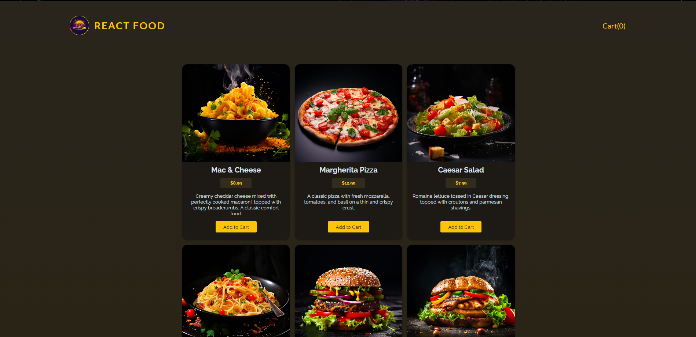
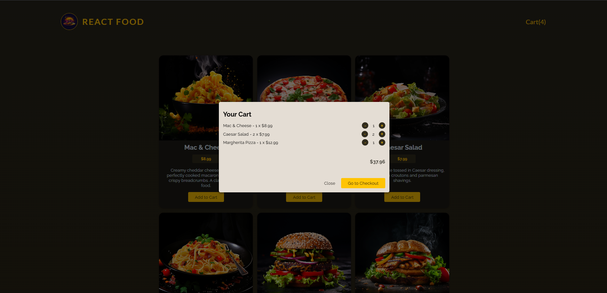
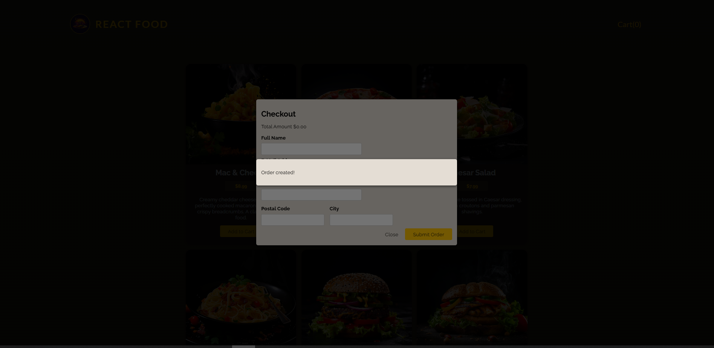
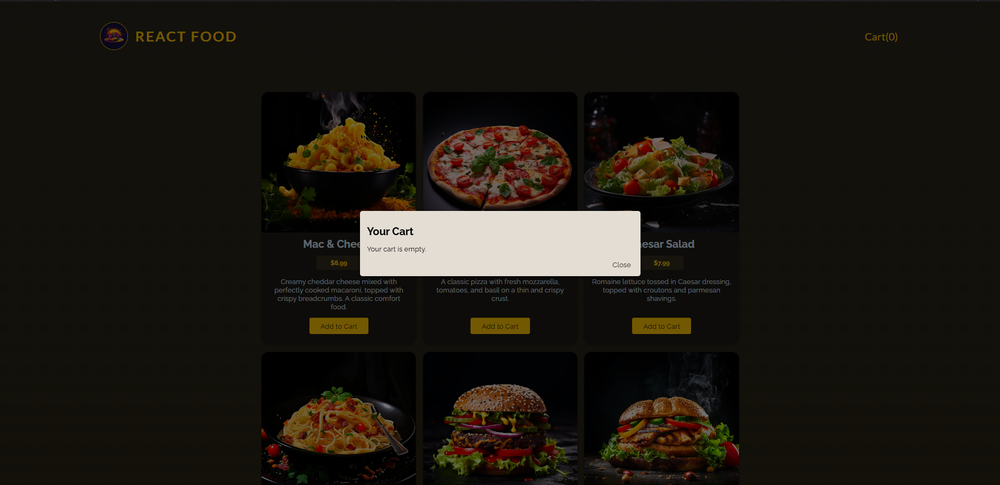

# React Food Order

A food ordering web application built with React. Users can browse available meals, add items to their cart, adjust quantities, and submit an order through a checkout form.

## Features

* Browse available meals
* Add meals to the shopping cart
* Increase and decrease item quantities
* Automatically remove items when their quantity reaches zero
* Calculate the cart total dynamically
* Checkout form with validation
* Submit orders to a REST API
* Clear the cart after a successful order
* Modal-based cart and checkout interfaces
* Loading and form action handling with React

## Tech Stack

### Frontend

* React
* JavaScript
* React Hooks
* React Context API
* React `use`
* React `useActionState`
* Fetch API
* CSS

### Backend

* Node.js
* Express.js
* REST API
* JSON file storage

## Screenshots

### Meals



### Shopping Cart



### Checkout



### Empty Cart



## Project Structure

```text
React-Food-Order/
├── src/
│   ├── components/
│   ├── store/
│   ├── utils/
│   ├── App.jsx
│   └── main.jsx
│
├── backend/
│   ├── data/
│   │   ├── meals.json
│   │   └── orders.json
│   ├── app.js
│   └── package.json
│
├── screenshots/
│   ├── screenshot1.png
│   ├── screenshot2.png
│   └── screenshot3.png
│
├── package.json
└── README.md
```

## Getting Started

### Frontend

Install the dependencies:

```bash
npm install
```

Start the React development server:

```bash
npm run dev
```

### Backend

Open another terminal and navigate to the backend:

```bash
cd backend
npm install
node app.js
```

The backend runs on:

```text
http://localhost:3000
```

## API

### Meals

```text
GET /meals
```

Returns the available meals.

### Orders

```text
POST /orders
```

Creates a new customer order.

The order contains the selected meals and customer information.

## Order Flow

```text
Browse Meals
     ↓
Add to Cart
     ↓
Adjust Quantities
     ↓
View Cart Total
     ↓
Checkout
     ↓
Validate Customer Information
     ↓
Submit Order
     ↓
Clear Cart
```
